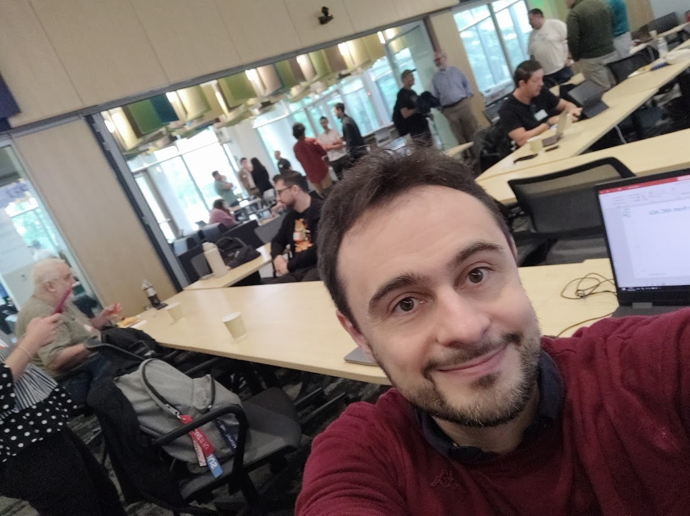
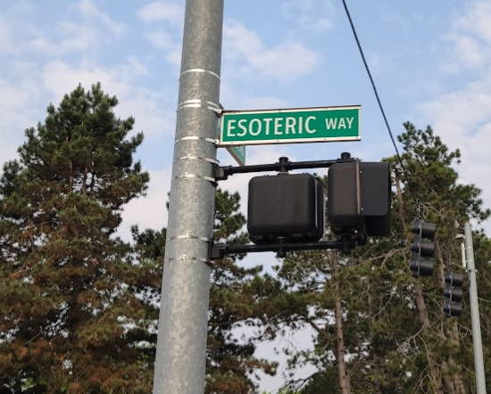

My first participation in the [Genetic Programming: Theory and Practice workshop](https://gptp-workshop.com/) (GPTP) was super-interesting. There was a lot of time for extended plenary discussions, which is usually a feature missing from larger conferences.

The focus of my presentation was the [Abstraction and Reasoning Corpus (ARC)](https://arcprize.org) challenge, and I tried to push the Genetic Programming crowd to participate in the current Kaggle competition, as I believe it could be GP's chance to shine! I've also shown some preliminary results in a joint work with Alberto Moraglio from University of Exeter.

It was an absolute pleasure to meet again Travis Desell, James McDermott, Giorgia Nadizar, Una-May O'Reilly, Leonardo Truijllo, and many other brilliant colleagues. Thanks to Michigan State University (MSU) and Wolfgang Banzhaf for hosting and organizing the event!