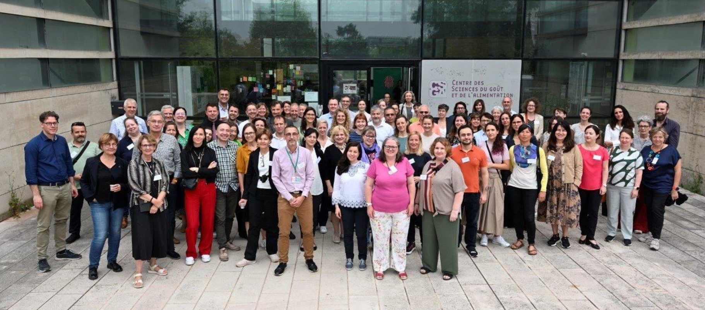

FutureFoodS is a Horizon Europe co-funded project I am participant of, running from 2024 to 2034, involving 86 partners from 29 countries. The FutureFoodS partnership aims to collectively achieve healthy, safe, environmentally friendly, socially secure, fair, and economically viable food systems for Europe. For more information, check the [FutureFoodS official website](https://www.futurefoodspartnership.eu/).

<!--more-->
